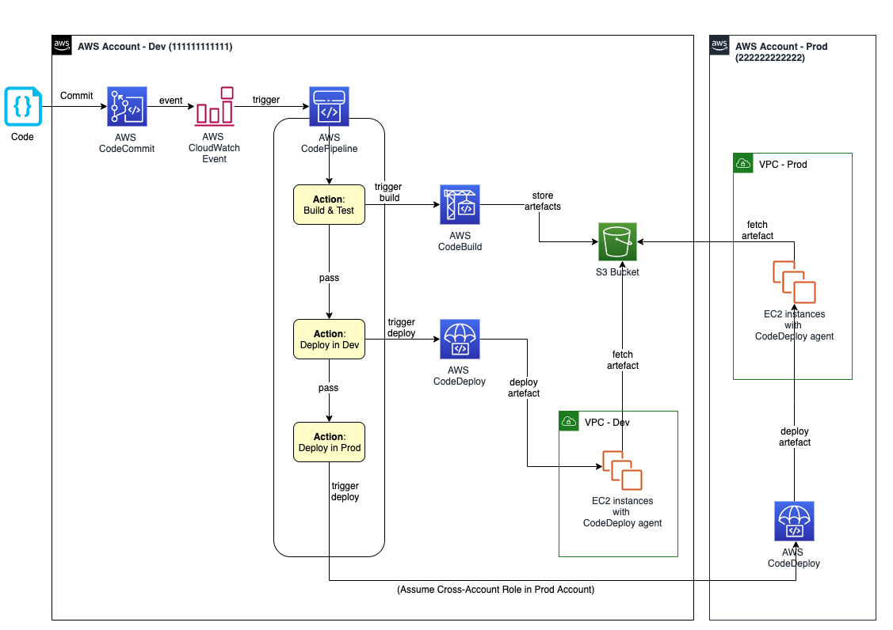

# APARTADO B 

A primera vista el STACK de AWS proporciona todo lo necesario para crear un pipeline de **CI/CD**.

Proporcionando absolutamente todo lo necesario para no salirte de su ecosistema, 
todas las sinergias entre los servicios están perfectamente estudiadas además de muy bien integradas. 

En el enunciado del ejercicio se nombra **CodeCommit**, **CodeBuild**, **CodeDeploy** y **CodePipeline**, 
que no sería lo mínimo necesario para poder crear un sistema de integración continua. 
Se requerirían de otros servicios como **S3**, **CloudWatch**
y distintos agentes tal como muestra el siguiente diagrama: 

El esquema muestra 2 entornos *Dev*, *Prod* puede que este ejemplo sea “simple“ 
por el número de entornos que tienen, que ventajas veo a este sistema. 

Según explica la documentación de AWS de este **ejemplo**:

 - [https://aws.amazon.com/es/blogs/devops/complete-ci-cd-with-aws-codecommit-aws-codebuild-aws-codedeploy-and-aws-codepipeline/](https://aws.amazon.com/es/blogs/devops/complete-ci-cd-with-aws-codecommit-aws-codebuild-aws-codedeploy-and-aws-codepipeline/)

En este ejemplo se usan las funcionalidades de "rolling deployments" y "automatic rollback" 
lo cual en caso de actualizar Produccion y en caso de error el tener el rollback automatizado 
es sinceramente una delicia, aunque claro esto se debe configurar, aunque Amazon ha pensado en todo: 

 - [https://aws.amazon.com/es/blogs/compute/automating-rollback-of-failed-amazon-ecs-deployments/](https://aws.amazon.com/es/blogs/compute/automating-rollback-of-failed-amazon-ecs-deployments/)

## Beneficios

Veo que los productos que ofrece Amazon están muy trabajados a que a priori todavía 
(por falta de experiencia) me producen **aun** cierto rechazo.
También veo que si soy capaz de crear un sistema como este seré capaz de 
proporcionar a cualquier compañía la infraestructura básica de desarrollo continua que puedan necesitar. Eso si supongo que no deberán hacer una gran inversión para el hardware y que este ecosistema para un equipo pequeño/mediano de desarrolladores pueda funcionar muy bien. 

También por veo que han trabajado en un **LINTER** dentro de su propio ecosistema en este caso **CodeGuru**
que de momento solo se puede usar para proyectos **Java** y **Python**. 
Pero sería la respuesta de Amazon a linters como **SonarQuve** o **Kiuwan**. 

## Inconvenientes

Creo que para empresas con miles de trabajadores pueda no ser la mejor opción por un tema de dinero,
entiendo que las grandes compañías revisaran y buscaran un hibrido entre algo totalmente en la nube 
y algunos servicios en local tales como repositorio, 
artefactos y documentación por un tema de seguridad y no depender de una tercera persona para estos 

También el inconveniente el grado de manejo que se debe 
tener para poder trabajar en un entorno totalmente CLOUD,
 ya que puede llegar a abrumar con la cantidad de opciones que tiene y la complejidad de estas 

En mi caso me da cierta “seguridad” el tener la oportunidad de poder hacer mis propias pruebas en local o en un entorno local fácil de replicar 

## Conclusiones 

Veo mucho potencial en el uso del **stack de AWS**, 
aunque requiere una implicación y especialización importante, 
y puede que en el estado actual “sea el futuro” o a lo mejor “es el futuro” 
sí que me parece un poco complicado,
 aunque en el estado actual creo que soy un **poco novato** a esto y lo que me falta es experiencia. 

También veo que **Jenkins** a la hora de mostrar y reflejar los pasos del proceso de CI/CD, puede favorecer el encontrar errores y mostrar métricas de los distintos test es más **user-friendly** y simple. 